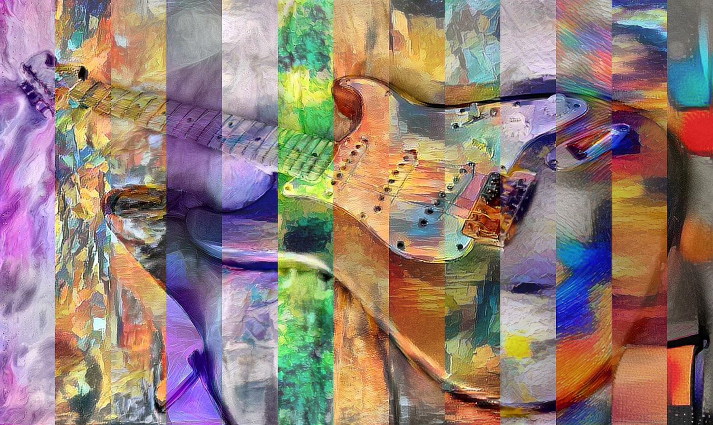
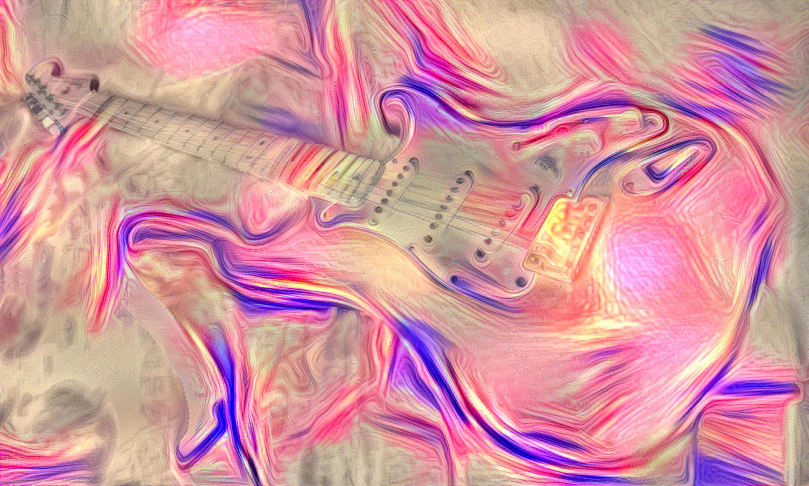

# Style Transfer Pop Art

This **Mathematica** script (_main.nb_) uses the _ImageRestyle_ function to transfer the art style from one image to another. After transferring a variety of examples, and selecting the best ones, the companion code (_merge.nb_) combines them in three ways: vertical slices, horizontal slices, and rectangles.



## How to use

1. Drop your "anchor" image to the root folder and name it **in.jpg**.

2.  Drop the styles you want to transfer styles from to the **styles** folder (_jpg_ or _png_).

3. Open the **main.nb** file and change the required parameters to suit your needs:

```
{imagesSize, styleWeight, goal, overlayWeight} = {1500, .8, "Quality", .25};
```

4. Run the script and be patient (the algorithms might take several hours). Be sure to disable "*Evaluation>Dynamic Updating Enabled*" option for faster results or change "Quality" for "Speed" as the _Performance Goal_.
5. The results will slowly be exported to the **batch** folder.


5. Once the algorithm has finished transferring the styles, select the best ones and drop them into the **finals** folder.


6. Run the **merge.nb** notebook and the final results will be exported to the **art** folder.


## More info

* Another application of this ideas (for time-lapse videos) can be accessed in my repository: https://github.com/Chipdelmal/ArtStyleTimeLapseTransfer
* For more information about the algorithms look at: https://arxiv.org/pdf/1508.06576.pdf
* An open-source package is available at: https://github.com/cysmith/neural-style-tf
